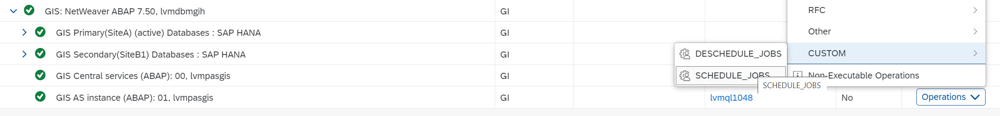
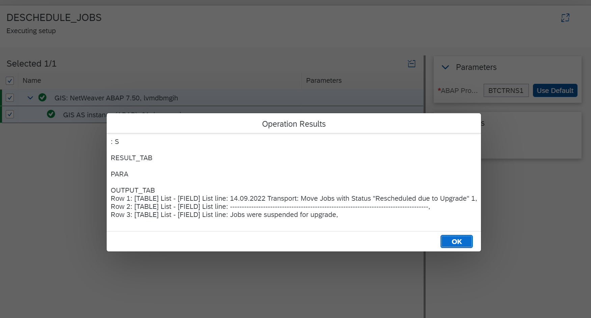

## Table of Contents
1. [Description](#Description)

2. [Prerequisites](#Prerequisites)

3. [Configuration](#Configuration)

4. [Execution](#Execution)

## Description
This enhancement gives you the chance to deschedule and schedule the jobs in your AS ABAP systems before and after planed maintenance scenarios (OS-,DB-,Kernel-patching).
Hereby the remote function module 'INST_EXECUTE_REPORT' is used. This function module awaits a parameter which reflects the report you'd like to run in your ABAP system. To deschedule jobs we use 'btctrns1' as a parameter and for scheduling the jobs again we use 'btctrns2'.
The custom operations forward the required value to the function module.

## Prerequisites
The ABAP system needs the RFC destination maintained within SAP LaMa to at least one client (e.g. 000).
Otherwise the operation will not work.

## Configuration
Please upload the provider definitions and custom operations into your SAP LaMa system.
The file ["Job_Maintenance.xml"](./LaMa_Config/Job_Maintenance.xml) contains the required content.
Provider definitions:
* JOB_MAINTENANCE

Custom Operations:
* DESCHEDULE_JOBS
* SCHEDULE_JOBS

## Execution
Now you're able to use the two Custom Operations to schedule and deschedule jobs in your ABAP systems.
You can either execute them on a standalone base or embed the steps in a custom process of your choice:
e.g.:
1. DESCHEDULE_JOBS
2. Stop System
3. ...
4. Start System
5. SCHEDULE_JOBS

Screenshots:

