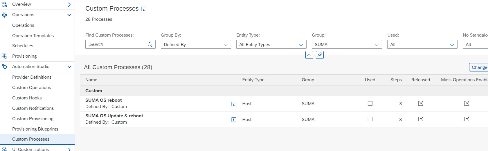
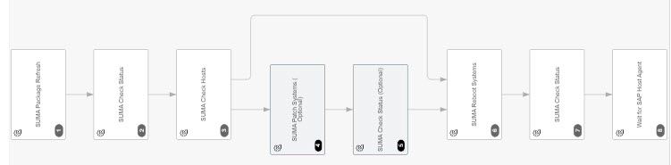
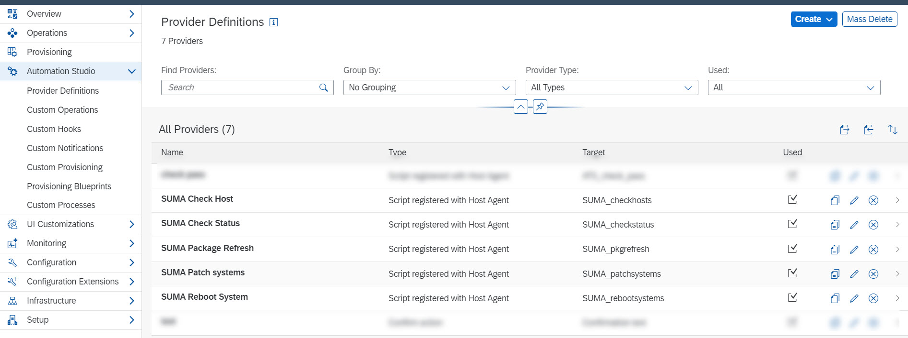
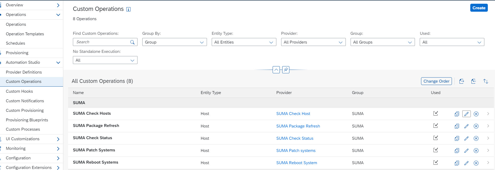
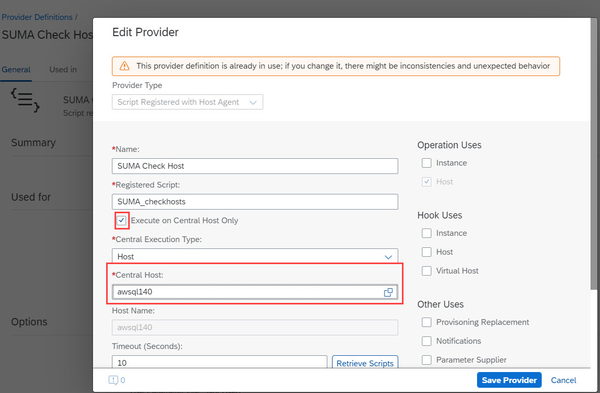

## Table of Contents
1. [Description](#Description)

2. [Prerequisites](#Prerequisites)

3. [Configuration](#Configuration)

4. [Execution](#Execution)

## Description
The integration between SUSE Manager (SUMA) and SAP LaMa is based on the SUSE API [documentation](https://documentation.suse.com/suma/4.2/api/suse-manager/index.html) and the implementation by Bo Jin [github](https://github.com/bjin01/patchsystems/tree/master/automic). The py files were modified to comply with the output requirements of SAP LaMa and to allow the process flow in between the scripts.

## Prerequisites
The python3 scripts in the directory [SUMA](./operations.d_conf/SUMA/) will be used by LaMa operations in order to schedule patch and reboot jobs. The py files will be triggered via the .conf files available in directory [operations.d](./operations.d_conf/). You need to select one host in your environment where these files (.py and .conf) are stored and executed. Most probably it's best to choose the SAP LaMa host as the central host for execution. The central host requires access to the SUMA host and it's APIs. 
Python3.6 or higher needs to be installed on this central host.

To enable the logon to the SUSE Manager, hostname and logon credentials must be stored in a yaml config file. Review the config file named [suma_config.yaml](./operations.d_conf/suma_config.yaml). We assume the file will be stored at folder /root/ on the central host. But you can switch to another folder. The email address for notification is optional. The optional parameter --email will attach the log file and send it via email on the host if postfix is configured and mutt is installed.

The log file is defined in each python script around line # 18. Feel free to change the destination and file name. The log file will be appended. So previous logs remain in the file. Watch out for the log size. 
*logfilename = "/var/log/susemanager/log/LaMa_suma_checkhosts_" + str(pid) + ".log"*

## Configuration
In this section we describe the .conf and .py files, the provider definitions, custom operations and custom processes which enable you to run the SUMA operations.
You get the provider definitions, custom operations and custom processes by uploading the file ["Custom_SUMA.xml"](./LaMa_Config/Custom_SUMA.xml) in your SAP LaMa system.

### Custom Process:
* SUMA OS Update & reboot
* SUMA OS reboot

The custom processes rely on the custom operations listed beneath. Their order of execution is a must.
### Provider definitions:
* SUMA Check Host
* SUMA Check Status
* SUMA Package Refresh
* SUMA Patch Systems
* SUMA Reboot Systems

### Custom Operations:
* SUMA Check Host
* SUMA Check Status
* SUMA Package Refresh
* SUMA Patch Systems
* SUMA Reboot Systems

The custom operations are not meant to be executed stand alone. They should be used in a custom process. For test purposes (check access to SUMA, etc. it's possible to change this setting temporarily.)

Furthermore you need to store the following .conf files in the directory /usr/sap/hostctrl/exe/operations.d on the server you've chosen as the central host:
### Config files
* SUMA_checkhosts.conf
* SUMA_checkstatus.conf
* SUMA_patchsystems.conf
* SUMA_pkgrefresh.conf
* SUMA_rebootsystems.conf

### Py files
* [SUMA folder](./operations.d_conf/SUMA/)

Store the complete folder SUMA in */usr/sap/hostctrl/exe/operations.d* at your central host.

After you've uploaded the xml config in your LaMa and copied the .conf and .py files in your operations.d directory select the central host for your executions (e.g. LaMa host).
This adaption is necessary for each and every SUMA provider definition.

Don't forget to adapt the authorization file [suma_config](./operations.d_conf/suma_config.yaml) and store it at a location of your choice (e.g. */roor/suma_config.yaml*)

## Execution
Now you're able to use the custom processes to either patch and reboot your hosts or only reboot them.
As mentioned above you should not use the custom operations stand alone. Use the custom processes instead. The custom processes can be used in "bigger" custom processes which deal with further maintenance activities throughout a regluar maintenance window.

The custom processes are meant for host execution, but if you'd like to do an OS update and reboot for all your hosts within one SAP SID you just need to integrate the custom process within a custom process that has entity type 'System'. *SUMA OS Update & reboot* will act as one step within this process and gets applied to all hosts of the system.
