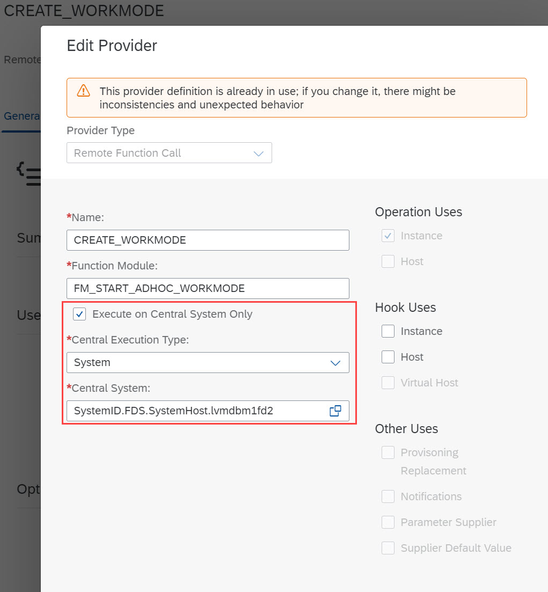
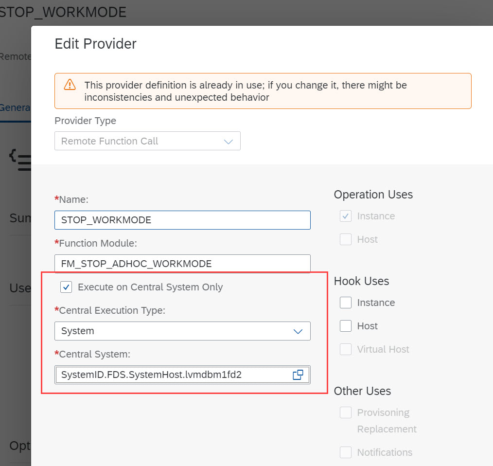
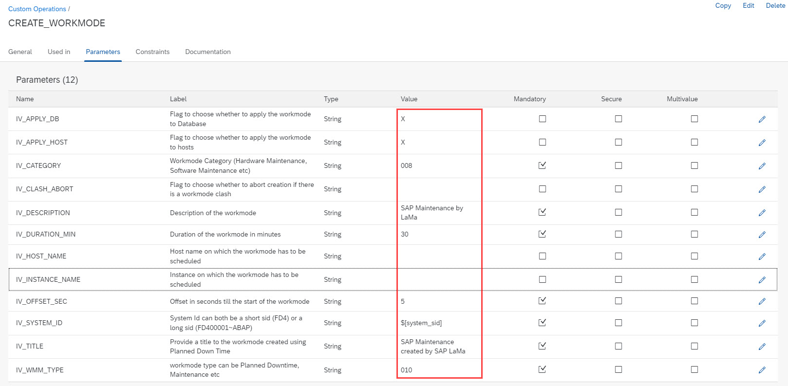
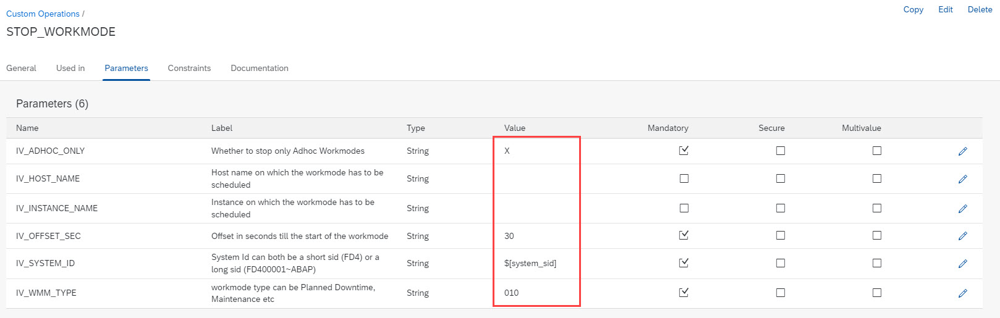
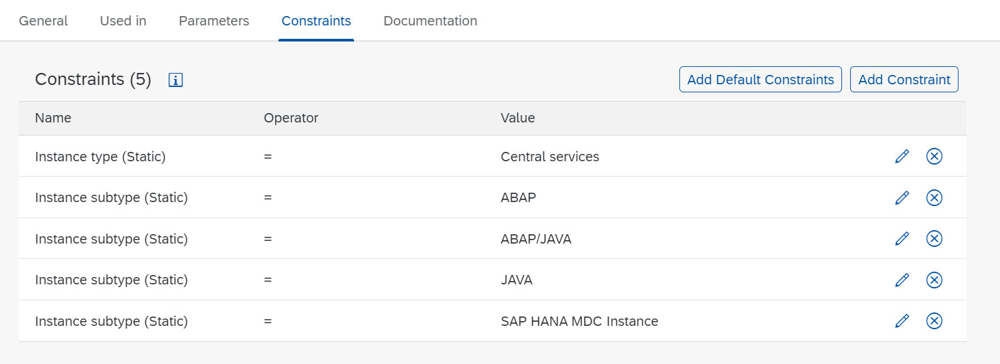
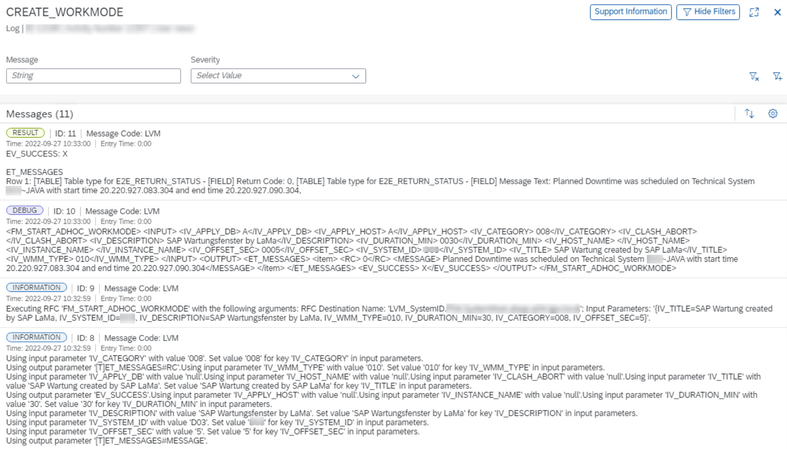

## Table of Contents
1. [Description](#Description)

2. [Prerequisites](#Prerequisites)

3. [Configuration](#Configuration)

4. [Execution](#Execution)

## Description
This enhancement gives you the chance to create and stop workmodes in SAP Solution Manager for your SAP systems before and after planned maintenance scenarios (OS-,DB-,Kernel-patching, etc.).
The function modules which are used for these adhoc workmode operations are described in [note 2391688 - Workmode API Documentation](https://launchpad.support.sap.com/#/notes/2391688).

The remote function module *FM_START_ADHOC_WORKMODE* is used for starting a workmode. This function module awaits some parameters like system SID, duration, description, etc. Details are described in the attachment of note 2391688. 
The remote function module *FM_STOP_ADHOC_WORKMODE* is used for stopping a workmode. This function module awaits some parameters like system SID and if only adhoc workmodes should get stopped by this operation. Details are described in the attachment of note 2391688.

## Prerequisites
The SAP Solution Manager or Focused Run system is discovered in your LaMa system.
The Solman/Focused run system needs the RFC destination maintained within SAP LaMa to the default client (e.g. 001).
It's required to maintain the destination for the client where workmodes are maintained per default.
Otherwise the operations will not work.

## Configuration
Please upload the provider definitions and custom operations into your SAP LaMa system.
The file ["Workmode_mgmt.xml"](./LaMa_Config/Workmode_mgmt.xml) contains the required content.
Provider definitions:
* CREATE_WORKMODE
* STOP_WORKMODE

Right after uploading the configuration, please update the provider definitions in regards to the setting "Execute on Central System Only".
They should be triggered on the Solution Manager or Focused Run system only  

Do the same for the STOP_WORKMODE provider defintion  

Please verify the parameters for each of the provider definitions. It might be that Solman and FRUN function modules differ a bit.
If there's a missmatch you could either read the parameters from scratch or upload a slightly modified version from the file ["FRUN_Workmode_mgmt.xml"](./LaMa_Config/FRUN_Workmode_mgmt.xml).

Custom Operations:
* CREATE_WORKMODE
* STOP_WORKMODE

The custom operations give you the chance to adapt the predefined parameters like offset, duration, type, ... .

Furthermore you can adapt the predefined constraints and enable the execution of the operations for different instance subtypes too:

## Execution
Now you're able to use the two Custom Operations to create and stop workmodes for your SAP systems in your Solman/FRUN system.
You can either execute them on a standalone base or embed the steps in a custom process of your choice:
e.g.:
1. CREATE_WORKMODE
2. Stop System
3. ...
4. Start System
5. STOP_WORKMODE

Screenshots:

